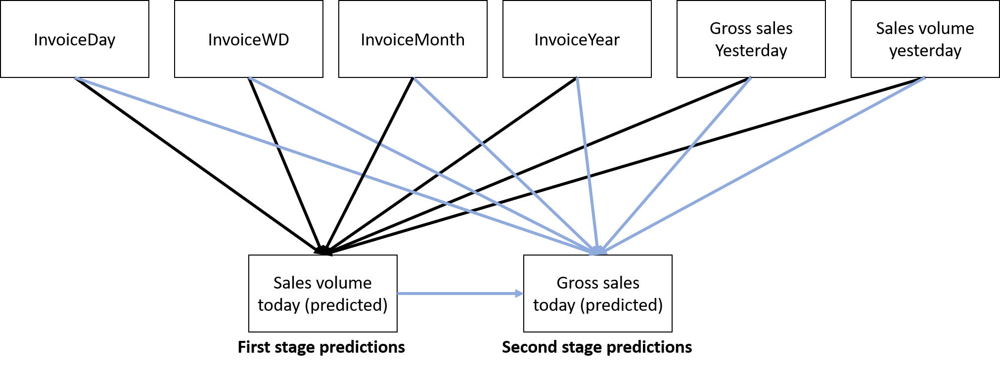

In this document, I will analyse the sales records for an online retailer for sales recorded between 01/12/2009 and 09/12/2011. I start with the data cleaning.

# Task 0: Loading libraries

To keep my work as minimialist as possible, I will use only three packages, `data.table`, `lubridate`, and `rjags`.

```{r message = FALSE, warning = FALSE}
options( scipen = 10000 )
knitr::opts_chunk$set(class.source='fold-show')

library( data.table )
library( lubridate )
library( rjags )

# Make a function for regex lookup of names
grepname = function( pattern, names_){
    names_[ grepl( pattern, names_ ) ]
}

knitr::opts_chunk$set(
  fig.path = "retail_report_files/figure-html/"
)
```

# Task 1: Loading the data and preliminary data cleaning

I load the data into `R`.

```{r}
retail_dataset = data.table( read.csv( "online_retail_II.csv" ) )
```

I check the dataset for duplicates. If the data comes from a distributed database, it is likely to have duplicate entries. Two examples of duplicate entries are shown below:

```{r class.source='fold-hide'}
duplicate_data = retail_dataset[ duplicated(retail_dataset) ]
n_duplicates = nrow(duplicate_data)
n_data = nrow(retail_dataset)

duplicate_instance = duplicate_data[1]
retail_dataset[ Invoice == duplicate_instance$Invoice &
    StockCode == duplicate_instance$StockCode ]
```

While it is possible that they are simply repeated orders, they are more likely to be duplicates, due to the identical invoice dates and quantities. Thus, I will remove all duplicate observations. In total, there were `r n_data` observations in the raw dataset and `r n_duplicates` duplicate orders.

```{r class.source='fold-hide'}
retail_dataset = unique(retail_dataset)
```

After the removal of unique values, the dataset contains `r nrow(retail_dataset)` observations and `r ncol(retail_dataset)` variables.

We note that the `InvoiceDate` variable has been read in as a `character`. Therefore, we will convert `InvoiceDate` to a `date` class. The rest of the variables have reasonable types given the documentation. I will also add an `ID` variable to track each item. In addition, to facilitate date-based subsetting, I will also create variables `InvoiceDays`, `InvoiceWeek`, and so on. Of note, `InvoiceDays` represents the day of the month, `InvoiceWD` represents the day of the week, `InvoiceWeek` represents the week of the year. 

```{r class.source='fold-hide'}
transform_dates = function( dataset, date_var_list ){
    dataset[ , InvoiceDate := {
        # Timezone is assigned to my locale, but should not be a big deal
        dates = as_date(InvoiceDate, format = "%Y-%m-%d")
        # as.POSIXlt( dates, "%Y-%m-%d %H:%M:%S" )
    } ]
    
    dataset[ , eval(date_var_list) := {
        days_ = day(InvoiceDate)
        # Use ISO 8601 standard for date
        weeks_ = isoweek(InvoiceDate)
        months_ = month(InvoiceDate)
        years_ = year(InvoiceDate)
        wdays_ = wday(InvoiceDate)
        list( days_, weeks_, months_, years_, wdays_ )
    } ]
}
```

```{r}
# Modification in place
date_var_list = paste0( "Invoice", c("Day", "Week", "Month", "Year", "WD") )
transform_dates( retail_dataset, date_var_list )
retail_dataset[ , ID := 1:.N ]
```

I note from the documentation that invoices prefixed with `C` represent canceled orders. So, to make it easier to find these, I will make a `Cancel` variable.

```{r}
retail_dataset[ , Cancel := grepl( "^[C,c]", Invoice ) ] 
```

# Task 2: Exploratory plots

A collection of exploratory plots. I made an aggregator function (hidden below). There are other ways to aggregate, such as making a `ts` object and using `aggregate`. But, I prefer the lower-level interface.

```{r class.source='fold-hide'}
time_aggregator = function( rawdata, aggregate_scale, custom_expression = NULL ){
    date_var_list_agg = paste0( "Invoice", c("Day", "Week", "Month", "Year") )
    time_scale_id = which( grepl( aggregate_scale, date_var_list_agg ) )
    allowed_scales = c("Day", "Week", "Month")
    
    if ( !aggregate_scale %in% allowed_scales ){
        cat( "Aggregate scale must be one of:", allowed_scales, "\n" )
        stop()
    }
    
    subset_time_scales = date_var_list
    ceiling_date_units = "day"
    if ( time_scale_id > 1 ){
        subset_time_scales = date_var_list_agg[-(1:(time_scale_id-1))]
        ceiling_date_units = tolower(aggregate_scale)
    }
    # Special case for weeks because weeks can span months
    if ( aggregate_scale == "Week" ){
        subset_time_scales = date_var_list_agg[c(2,4)]
        ceiling_date_units = tolower(aggregate_scale)
    }
    
    if ( is.null( custom_expression ) ){
        aggregated_data = rawdata[ , {
            sales_volume = sum(Quantity)
            # sales_volume = .N
            period_end = ceiling_date( InvoiceDate[1], unit = ceiling_date_units ) - days(1)
            list( sales_volume, period_end )
        }, by = eval(subset_time_scales) ]
    } else{
        aggregated_data = rawdata[ , {
            period_end = ceiling_date( InvoiceDate[1], unit = ceiling_date_units ) - days(1)
            eval(custom_expression)
        }, by = eval(subset_time_scales) ]
    }
    aggregated_data
}
```

### Daily/Weekly/Monthly Sales Volumes

I have defined "sales volume" as the number of units sold.

Figure 1 shows the daily sales volumes. We see that there are some spikes of large daily sales and some of these are accompanied closely by large decreases. From inspection of the data, this appeared to be returns from the previous high-sales day. I will handle these large returns properly in a later section.

From the series, we see low sales near the end/start of a year. There also appears to be some local autocorrelation in the later parts of the year (October, November). There may also be weekly seasonality.

```{r fig.cap="Figure 1. Daily sales volume.", class.source='fold-hide'}
aggregate_scale = "Day"
daily_sales = time_aggregator( retail_dataset, aggregate_scale )
daily_sales[ , plot( period_end, sales_volume / 1000, type = "l",
    xlab = "Day", ylab = "Sales volume / 1000",
    main = "Daily sales volume") ]

daily_sales[ , sales_volume := {
    big_refund_days = which( sales_volume < -100 )
    sales_volume[ big_refund_days - 1 ] = 
        sales_volume[ big_refund_days - 1 ] +
        sales_volume[ big_refund_days ]
    sales_volume[ big_refund_days ] = 0
    sales_volume
} ]
```

Figure 2 shows the weekly volumes. The weekly sales volume appears to be higher near the end of the year (September-November) than in the other parts of the year. In 2010, weekly sales were also relatively high around March, but not in 2011. It may be worthwhile to investigate this if I had more time.

```{r fig.cap="Figure 2. Weekly sales volume.", class.source='fold-hide'}
aggregate_scale = "Week"
weekly_sales = time_aggregator( retail_dataset, aggregate_scale )
weekly_sales[ , plot( period_end, sales_volume/1000, type = "l",
    main = "Weekly sales volume", xlab = "Week", 
    ylab = "Sales volume /1000" ) ]
```

Monthly sales (Figure 3) tends to increase in the later parts of the year. In 2012, there is an apparent decrease for December. However, this is because we have incomplete monthly data for 2012.


```{r fig.cap="Figure 3. Monthly sales volume.", class.source='fold-hide'}
aggregate_scale = "Month"
monthly_sales = time_aggregator( retail_dataset, aggregate_scale )
monthly_sales[ , plot( period_end, sales_volume/1000, type = "l",
    main = "Monthly sales volume", xlab = "Month", 
    ylab = "Sales volume / 1000" ) ]
```

### Last month revenue share by product and by customer

```{r class.source='fold-hide'}
# A function for subsetting based on some time unit
date_subsetting = function( datelist, date_, timescale ){
    list_floor = ceiling_date( datelist, unit = timescale )
    date_floor = ceiling_date( date_, unit = timescale )
    list_floor == date_floor
}
revenue_by_subset = function( rawdata, subset_variable ){
    revenue_dt = rawdata[ , {
        list( revenue = sum(Quantity * Price) )
    }, by = eval(subset_variable) ]
    revenue_dt[ , revenue_share := revenue / sum(revenue ) * 100 ]
    revenue_dt
}
```

In our hypothetical scenario, the current month is 12/2011. So, the previous month is 11/2011.

```{r class.source='fold-hide'}
current_month = as_date("2011-12-01")
last_month = current_month - months(1)
timescale = "month"
last_month_data = retail_dataset[ date_subsetting( InvoiceDate, last_month, timescale ) ]

revenue_by_product = revenue_by_subset( last_month_data, subset_variable = "StockCode" )
revenue_by_customer = revenue_by_subset( last_month_data, subset_variable = "Customer.ID" )
```

Figure 4 shows the revenue share by stock code. Because there are a lot of products, I have enumerated the products from one to the number of products and omitted the axis labels. For products with unusual revenue share, I have put their stock code as a label. The item with the largest positive is `DOT`, which has the description `DOTCOME POSAGE`. Because it is positive, it is probably some postage fees that the customer pays to the company.

For items with negative revenue share, we see items like `BANK CHARGES`, `AMAZON FEE`, `CRUK`, and `D`. `AMAZON FEE` appears to be Amazon seller fees. `CRUK` appears to be charity donations to the Cancer Research UK. `D` denotes discounts. Therefore, it appears that this company uses their invoice system for all invoices, rather than having a dedicated sales system. This is important for analyses of gross sales.

```{r fig.cap="Figure 4. Revenue share by product (stock code)", class.source='fold-hide'}
revenue_by_product[ , {
    plot( 1:.N, revenue_share, pch = 16, xlab = "StockCode", xaxt = "n",
        ylab = "Revenue share (%)", main = "Revenue share by product")
    sales_subset = revenue_share > 1.5
    text( (1:.N)[ sales_subset ], revenue_share[ sales_subset ], StockCode[sales_subset],
        col = "blue", srt = 45 )
    sales_subset = revenue_share < 0
    text( (1:.N)[ sales_subset ], revenue_share[ sales_subset ], StockCode[sales_subset],
        col = "red", srt = 45)
    } ]
```


Figure 5 shows the revenue share by customer. Because there are a lot of customers, I have enumerated the products from one to the number of customers and omitted the axis labels. For customers with high revenue share, I have put their customer ID as a label. The customer with the highest revenue share is `NA`. From inspection of the data, this appears to be a missing value and/or a catch-all for non-sales items, such as inventory write-offs, Amazon fees, bad debts, and so on.

```{r fig.cap="Figure 5. Revenue share by customer", class.source='fold-hide'}
revenue_by_customer[ , {
    plot( 1:.N, revenue_share, pch = 16, xlab = "Customer", xaxt = "n",
        ylab = "Revenue share (%)", main = "Revenue share by customer")
    sales_subset = revenue_share > 1.5
    text( (1:.N)[ sales_subset ], revenue_share[ sales_subset ]+2, Customer.ID[sales_subset],
        col = "blue", srt = 45 )
} ]
```


### Weighted average monthly sale by volume

Figure 6 shows the average monthly sales, weighted by the sales volume across all the months. This is computed by taking each item purchased and multiplying it by frequency weights obtained by rescaling according to the quantity of each item sold. This is done within each month. The pattern somewhat resembles the monthly sales volume in Figure 3. However, a notable difference is that for December 2012, there is no large decrease in the average weighted sales. This is because these monthly sales are weighted according to the partial data for December 2012.

We see that the volume-weighted average monthly sale price ranges between 1.5 and 2.2. And that the average tends to be higher in 2011 than 2010. Looking at the monthly sales volume (Figure 3), the sales volume in early 2011 was lower than in early 2010. This suggests that the company may be selling more expensive items or increasing their markups to achieve higher monthly sales prices.

```{r fig.cap="Figure 6. Weighted average monthly sale by volume", class.source='fold-hide'}
custom_expression = expression({
    mean_sale = sum( Quantity * Price / sum(Quantity) )
    list( mean_sale = mean_sale, period_end = period_end)
    })

weighted_avg_month_sale_vol = time_aggregator( retail_dataset, "Month",
    custom_expression )

weighted_avg_month_sale_vol[ , {
    plot( period_end, mean_sale, type = "l",
        main = "Average monthly sales weighted by volume",
        ylab = "Average monthly sales weighted by volume",
        xlab = "Month")
} ]
```


# Task 3. Cleaning negative volumes

Depending on how fine-grained our analysis is, we might want to take different approaches to dealing with the negative sales volumes.

If we require information about the individual actual sales in a micro-level analysis, then we may want to dynamically adjust sales records as refunds are made. However, if we are more interested in aggregate sales, then if each refund has a corresponding purchase in the dataset, then refunds will be adjusted.

As described in the task, some returns pertain to sales before the data collection, so we should remove those in any case.

Therefore, we are interested in refunds that we cannot match to a purchase. There are three reasons that a refund cannot be matched:

1. The purchase occurred before the data collection. This is what we want to remove.
2. The returns are a data entry error. There are some refunds that occurred over a year after the data collection start that could not be matched to purchases. In my view, it is unlikely for customers to be claiming refunds on goods purchased over a year ago (Examples folded).

```{r class.source='fold-hide', eval = FALSE}
# For example, consider the situation:
retail_dataset[ StockCode == 22087 & Customer.ID == 17337,{
    list( Invoice, StockCode, Description, Quantity, InvoiceDate, Price, 
        Customer.ID )
    }]

# We see that customer 17337 has made two refunds of 12 units of item 22087. It is possible that one of these refunds is for a purchase before the data collection start. However, this means this refund would have been for items purchased over a year ago. Instead, it is more likely that these are a data entry error. Further, I will assume that these errors are dealt in some way (e.g., absorbed into bad debt).
```


3. The third option for negative sales quantities is that the invoicing system is used for inventory write-offs (e.g.,  defective inventory), samples for clients, bank charges, and postage (Examples folded). 
```{r class.source='fold-hide', eval = FALSE}
# For example, consider:
head( retail_dataset[ is.na(Customer.ID ) & Quantity < 0, {
    list(Invoice, StockCode, Description, Quantity, InvoiceDate, Price,
        Customer.ID)
    } ] )
# We can see from the description that these are probably write-offs. We also notice that the invoice does not have the `C` prefix. So, they do not represent canceled orders. 
```

Taking everything together, we want to remove the entries that represent returns for purchases that occurred before the start date of the data collection. The criteria are:

1. The Invoice field is prefixed with `C`
2. The recorded date of the refund (`InvoiceDate`) is within one year of the start date
3. The refund is not matched with a corresponding purchase

A further assumption is that refunds are for the entire purchase. That means, the `Quantity` of the refund will be the negative of the `Quantity` of the purchase. If I had more time, I could dynamically adjust the purchases for each item and customer combination.

The process for cleaning the data given the criteria above and the assumptions about refunds is:

1. Subset the data up to one year from the start of the data collection.
2. Split the data based on `Cancel` into Purchases and Refunds.
3. Left join the Purchases IDs onto Refunds IDs.
4. Remove rows with the left join IDs from the overall dataset.

The code is folded below:

```{r class.source='fold-hide'}
date_slice = function( dataset, date_start, time_period ){
    date_interval = interval( date_start, date_start + time_period )
    dataset[ InvoiceDate %within% date_interval, ]
}
first_year_data = date_slice( retail_dataset, min(retail_dataset$InvoiceDate), 
    years(1) )
# Split the data into Refunds and Purchases
first_year_refunds = first_year_data[ Cancel == TRUE ]
first_year_purchases = first_year_data[ Cancel == FALSE ]
# Take absolute value of Refunds Quantity so it matches the purchases
first_year_refunds[ , Quantity := abs(Quantity) ]
# Perform the left join
first_year_purchases[ first_year_refunds, matched_refund_ID := i.ID,
    on = c("StockCode", "Customer.ID", "Country", "Quantity", "Price") ]

n_first_year_refunds = nrow(first_year_refunds)
n_first_year_matched_refunds = sum( !is.na(first_year_purchases$matched_refund_ID) )

matched_refund_ID = first_year_purchases[ !is.na(matched_refund_ID), matched_refund_ID ]
unmatched_refunds = first_year_refunds[ ! ID %in% matched_refund_ID ]

nrow_whole_data = nrow(retail_dataset)
retail_dataset_refund_adjusted = retail_dataset[ ! ID %in% unmatched_refunds$ID ]
nrow_adjusted_data = nrow(retail_dataset_refund_adjusted)
```

I found `r n_first_year_refunds` refunds in the first year. I was able to match `r n_first_year_matched_refunds` refunds to corresponding purchases. After removing the unmatched refunds in the first year, the dataset had `r nrow_adjusted_data` observations.

For completeness, I will also removed the matched refunds but throughout the dataset. The code is below (folded):

```{r class.source='fold-hide'}
retail_dataset_refund_adjusted_refunds = retail_dataset_refund_adjusted[ Cancel == TRUE ]
retail_dataset_refund_adjusted_purchases = retail_dataset_refund_adjusted[ Cancel == FALSE ]

retail_dataset_refund_adjusted_refunds[ , Quantity := abs(Quantity) ]

retail_dataset_refund_adjusted_purchases[ retail_dataset_refund_adjusted_refunds, 
    matched_refund_ID := i.ID,
    on = c("StockCode", "Customer.ID", "Country", "Quantity", "Price") ]

ID_removal = retail_dataset_refund_adjusted_purchases[ !is.na(matched_refund_ID), {
    list( purchase_ID = ID, refund_ID = matched_refund_ID )
    } ]
matched_refunds = nrow(ID_removal)

retail_dataset_refund_adjusted2 = 
    retail_dataset_refund_adjusted[ ! ID %in% unlist( ID_removal ) ]

nrow_adjusted = nrow(retail_dataset_refund_adjusted)
nrow_adjusted2 = nrow(retail_dataset_refund_adjusted2)
```

I was able to match `r matched_refunds` over the whole dataset. After removing the matched refunds, the dataset had `r nrow_adjusted2` observations.

# Task 4. Modelling the dataset

I want to predict the revenue for the month 12-2011. I will define revenue as the total as income from business operations (sales), but not accounting for expenses. Expenses would include things like Amazon listing fees, inventory write-offs, discounts and inventory given away. Refunds and purchase cancellations will be included in revenue because they represent negative sales.

## Task 4. Part A

It is clear that there are heavy time-series elements in this dataset. There seems to be weekly and monthly patterns in the dataset. For example, sales tend to increase near the end of the year. Therefore, we need to keep in mind adjustments for autocorrelation in our approach.

We have information about the date (day, week, month, year), individual purchases (invoice), products (stock code), customers, and county. 

We can analyse this information at multiple levels. For example, with customer information, we could account for returning customers, the rate of obtaining and losing customers. An alternative approach could be to use items and descriptions to improve revenue prediction. For example, Christmas decorations probably account for more of the December revenue than other kinds of items.

To simplify the approach, I will use daily aggregate data across customers and items for predicting the December 2011 revenue. On examination of the daily gross sales, there is significant variability that I am doubtful whether tracking customers and product types will produce a big enough of a signal over what we can already get from daily aggregate data.

Therefore, the variables that I will have available for building a model include:

* Daily sales volume
* Daily gross sales (Quantity * Price summed over all sales)
* InvoiceDay (Day of the month)
* InvoiceWeek (Week of the year)
* InvoiceMonth (Month of the year)
* InvoiceYear (Year)
* InvoiceWD (Day of the week)

Clearly, if I am predicting `gross_sales` for today, I cannot use the `gross_sales` or `sales_volume` today. The most recent information I would have is yesterday's sales and volume.

### Solution 1

We can use robust and well-performing algorithms for predictive modelling. Examples include random forests or XGBoost. Because RFs and XGBoost do not account for the time-series structure of the data, we would have to make new variables or do some transformations to make the data amenable to these models. For example, we may find autocorrelation in daily sales during November, where the daily sales tends to increase. To make this data suitable for RF/XGBoost, I could model changes in daily sales (first order differencing).

This solution has the advantage of using well-known algorithms that tend to produce good results. These algorithms also have good APIs/wrapper functions, such as `randomForest` or `xgboost` in `R`, so programming the solution will be quite fast. However, these solutions tend to be less interpretable than parametric regression models. Further, because these are non-parametric models, if we have good domain knowledge, it is difficult to incorporate the domain knowledge into the analysis.

### Solution 2

An alternative solution is parametric linear regression. I can account for first-order autocorrelation in `gross_sales` using a lagged response variable and account for weekly/monthly seasonal effects using the week and month variables as seasonal factors. 

A difficulty in multiple linear regression for time series is obtaining reasonable estimates of uncertainty in the response variable. It is also difficult to combine different relationships. For example, we may want to predict sales volume for a given day and then use that to predict gross sales. In this case, the uncertainties for gross sales are very difficult to obtain.

### Solution 3

A third solution is to use a Bayesian hierarchical generalised linear model. Using our business knowledge, we know the revenue depends on the price of items and the number items sold. Because I have aggregated over the different items, the price of individual items is less important. Therefore, a useful predictor for gross sales is the corresponding sales volume for that day. However, because this is a time-series situation, we do not know the sales volume for the day that we want to predict. 

However, if we can predict today's sales volume, then we can use that prediction in our prediction of today's gross sales. In a sense, we treat today's sales volume as "missing" data, but "impute" this missing data and use it to predict today's gross sales. It is hard to do this using the other solutions (XGBoost, RF, regular linear regression), but it is easy to do in a Bayesian model.

Therefore, the solution I propose involves a network of relationships between different variables and predicted variables. In the first stage of the model, I predict today's sales volume. Then, I use the predicted sales volume to predict today's gross sales. The predicted revenue for December is obtained from adding the daily gross sales predictions in December. See Figure 7.



In the Bayesian model, the uncertainty in our predictions of sales volume are automatically accounted for in our predictions for gross sales. The overall uncertainty for the December revenue is obtained by aggregating across the daily gross sales predictions. 

In addition, the Bayesian framework is very flexible. If we want to add additional information, such as customer tracking or product-level information, then we can add this to the model in the same way that we use the predicted sales volume.

Of the three solutions, the Bayesian solution is the most time-consuming because I have to program the model. There is no nice interface like there is for linear regression or XGBoost or RFs.

## Task 4. Part B.

In terms of predictive accuracy, the XGBoost/RF models may be more accurate because they tend to be very highly performant prediction algorithms. In terms of effort, the Bayesian solution is the most time consuming.

However, I value the flexibility that the Bayesian model offers in terms of incorporating domain knowledge and external information. In addition, I also value the flexibility if we want to 
 add product- or customer-level information in a future analysis. The interpretability of the Bayesian model is also desirable (Figure 7). In addition, it is very easy to obtain prediction uncertainties for revenue that also account for uncertainty in sales volume. Finally, I have substantial expertise in Bayesian inference. Therefore, based on flexibility, extensibility, interpretability, and personal expertise, I will use the Bayesian model.

## Task 4. Part C.

Before fitting the model, we need to do some further data cleaning. Some items are marked with `Price = 0`. These seem to mostly be inventory adjustments, such as water damaged items, inventory errors, and items given away. Because these are not contributors to revenue, I will remove these from the dataset. In addition, there are items with negative price. These are bad debt adjustments. Bad debt adjustments are usually an expense, so I will not count them as sales-contributions to revenue. In any case, bad debt adjustments are known in advance, so if a bad debt adjustment is coming up, this can be subtracted from the revenue if needed.

I make some adjustments to the data before modeling.

**Uniform time differences.** An adjustment we have to make for the model is uniform time differences between observations. In the original dataset, there are days where nothing is recorded. I will fill in these days with zero sales. Therefore, the daily sales/volume dataset for modeling will have one observation for each day beginning 2009-12-01 to 2011-12-23. The extra days at the end of the series are for predictions for the rest of December.

**Saturdays.** I will remove Saturdays. From the historical data, Saturdays have zero sales. The only exception is the first Saturday in the dataset. Because the other 105 Saturdays do not have non-zero sales, I will remove all the Saturdays for uniformity.

**Dec 24 - Jan 1** Another adjustment is that the days between December 24 and January 1 have no sales. Presumably people are on Christmas holiday, so the shop is not operating. I will remove these dates from the dataset.

**Partial December 2012 data.** Because we have monthly factors in the model, the partial data for December 2012 is problematic. I will remove these data when fitting the model.This is easier than adjusting for the partial December data in the model. Then in my prediction, I will substitute the December predictions where we have data available. It is a bit awkward having partial data and then making predictions based on the partial data, rather than just predicting for the whole month starting from the previous month. However, because I have sequential dependence in my model, using the known partial December data will likely give more accurate forecasts.

**Incomplete 2012 yearly data.** A final adjustment is also related to partial December data. Because I have a yearly factor variable, the partial December data is problematic. On inspection of the yearly gross sales and sales volume, 2010 was higher than 2009. But so far, 2011 seems similar to the first 11 months of 2010. Therefore, for modeling, I will treat the year-effect for 2011 as the same for 2010.

```{r class.source='fold-hide'}
model_retail_data = retail_dataset_refund_adjusted2
# Price == 0 for write-off inventory things
# Price < 0 for bad debt
model_retail_data = model_retail_data[ Price > 0 ]

custom_expression_daily = expression({
    # sales_volume = .N
    sales_volume = sum(Quantity)
    gross_sales = sum( Quantity * Price )
    list( gross_sales = gross_sales, sales_volume = sales_volume,
        period_end = period_end)
})
model_daily_sales = time_aggregator( model_retail_data, "Day", custom_expression_daily )

end_business_year = as_date("2011-12-23")
end_data_date = max(daily_sales$period_end)

# Make a sequence of dates
model_data = daily_sales[ , {
    date_sequence = as_date(seq(min(period_end), end_business_year, 1))
    list( period_end = date_sequence )
    } ]

# Add the date variables
model_data[ , eval(date_var_list) := {
    days_ = day(period_end)
    # Use ISO 8601 standard for date
    weeks_ = isoweek(period_end)
    months_ = month(period_end)
    years_ = year(period_end)
    wdays_ = wday(period_end)
    list( days_, weeks_, months_, years_, wdays_ )
} ]

# Combine the date sequence and the daily sales data
model_data = merge(model_data, model_daily_sales, all.x = TRUE )

model_data[ , InvoiceYear := factor(InvoiceYear, levels = c(2009, 2010, 2011) ) ]
model_data[ , InvoiceWD := wday( period_end, label = T ) ]

# Remove Saturdays
model_data = model_data[ InvoiceWD != "Sat" ]
# Remove Christmas breaks
model_data = model_data[ !(InvoiceMonth == 12 & InvoiceDay >= 24) ]

# Fill missing values with zero, except for the days we want to predict
model_data[ is.na( gross_sales ) & period_end < end_data_date, gross_sales := 0 ]
model_data[ is.na( sales_volume ) & period_end < end_data_date, sales_volume := 0 ]

model_data[ , realInvoiceYear := InvoiceYear ]

model_data[ InvoiceYear == 2011, InvoiceYear := "2010" ]

model_data_dec_only = model_data[ period_end >= (as_date( "2011-12-01" ) - days(1)) ]
model_data_no_dec = model_data[ period_end < as_date( "2011-12-01" ) ]

save( model_data, model_data_no_dec, model_data_dec_only, file =  "model_data.RData" )
```

**Model assumptions**

The model assumes that the daily sales volme and gross sales have Normal distributions and the residuals do not depend on any other variable, such as time.

To deal with these assumptions, we need to decide how much autocorrelation we want to account for in the dataset. By first-order differencing, I determined that first-order autocorrelation is enough to model most of the autocorrelation in the sales volume and gross sales. The code for the plots are folded below, but omitted for brevity.

Overall, I am sufficiently satisfied with the model assumptions given the time that I have to investigate and construct the model.

```{r fig.cap="Figure 8. Differenced daily sales volume.", class.source='fold-hide', eval = FALSE}
model_data[ , {
    plot( period_end[-1], diff(sales_volume), type = "l",
        xlab = "Day", ylab = "Sales volume (first order difference)",
        main = "Differenced daily sales volume")
    } ]

model_data[ , {
    plot( period_end[-1], diff(gross_sales), type = "l",
        xlab = "Day", ylab = "Gross sales (first order difference)",
        main = "Differenced daily gross sales")
    } ]
```

As we saw previously in Figures 1 to 3, there may be daily, monthly, and yearly effects. So, these will also be included in the model.

The `JAGS` code for the model is folded below:

```{r class.source='fold-hide', eval = FALSE}
{jags_model = "
    model{
    # Priors
    gross_sales_tau ~ dgamma ( 0.01, 0.01 )
    sales_volume_tau ~ dgamma( 0.01, 0.01 )
    
    sales_volume_AC1 ~ dnorm( 0, 1 )
    gross_sales_AC1 ~ dnorm( 0, 1 )

    sales_volume_month_tau ~ dnorm( 0, 1 )
    gross_sales_month_tau ~ dnorm( 0, 1 )
    for ( i in 1:12 ){
        sales_volume_month[i] ~ dnorm( 0, sales_volume_tau * exp(sales_volume_month_tau) )
        gross_sales_month[i] ~ dnorm( 0, gross_sales_tau * exp(gross_sales_month_tau) )
    }
    
    sales_volume_wday_tau ~ dnorm( 0, 1 )
    gross_sales_wday_tau ~ dnorm( 0, 1 )
    for ( i in 1:6 ){ #Saturday = 7 missing
        sales_volume_wday[i] ~ dnorm( 0, sales_volume_tau * exp(sales_volume_wday_tau) )
        gross_sales_wday[i] ~ dnorm( 0, gross_sales_tau * exp(gross_sales_wday_tau) )
    }
    
    sales_volume_mday_tau ~ dnorm( 0, 1 )
    gross_sales_mday_tau ~ dnorm( 0, 1 )
    for ( i in 1:31 ){
        sales_volume_mday[i] ~ dnorm( 0, sales_volume_tau * exp( sales_volume_mday_tau ) )
        gross_sales_mday[i] ~ dnorm( 0, gross_sales_tau * exp( gross_sales_mday_tau ) )
    }
    
    sales_volume_year_tau ~ dnorm( 0, 1 )
    gross_sales_year_tau ~ dnorm( 0, 1 )
    for ( i in 1:2 ){
        sales_volume_year[i] ~ dnorm( 0, sales_volume_tau * exp( sales_volume_year_tau ) )
        gross_sales_year[i] ~ dnorm( 0, gross_sales_tau * exp( gross_sales_year_tau ) )
    }
    
    gross_sales_volume_beta ~ dnorm( 0, 0.001 )
    gross_sales_volume_beta2 ~ dnorm( 0, 0.001 )
    sales_volume_gross_sales_int ~ dnorm( 0, 0.001 )
    
    for ( i in 2:length(sales_volume) ){
        sales_volume_pred[i] =
            sales_volume_AC1 * sales_volume[i-1] +
            sales_volume_month[InvoiceMonth[i]] +
            sales_volume_wday[InvoiceWD[i]] +
            sales_volume_mday[InvoiceDay[i]] +
            sales_volume_year[InvoiceYear[i]]
        sales_volume[i] ~ dnorm( sales_volume_pred[i], sales_volume_tau )
        pred_sales_volume[i] ~ dnorm( sales_volume_pred[i], sales_volume_tau )

        gross_sales_pred[i] = 
            gross_sales_AC1 * gross_sales[i-1] +
            gross_sales_volume_beta2 * sales_volume[i-1] +
            gross_sales_volume_beta * sales_volume_pred[i] +
            sales_volume_gross_sales_int * sales_volume[i-1] * gross_sales[i-1] +
            gross_sales_month[InvoiceMonth[i]] +
            gross_sales_wday[InvoiceWD[i]] +
            gross_sales_mday[InvoiceDay[i]] +
            gross_sales_year[InvoiceYear[i]]
        gross_sales[i] ~ dnorm( gross_sales_pred[i], gross_sales_tau ) 
        pred_gross_sales[i] ~ dnorm( gross_sales_pred[i], gross_sales_tau )
    }
    
    for ( i in 10:length(dec_sales_volume) ){
        dec_sales_volume_pred[i] =
            sales_volume_AC1 * dec_sales_volume[i-1] +
            sales_volume_month[dec_InvoiceMonth[i]] +
            sales_volume_wday[dec_InvoiceWD[i]] +
            sales_volume_mday[dec_InvoiceDay[i]] +
            sales_volume_year[dec_InvoiceYear[i]]
        pred_dec_sales_volume[i] ~ dnorm( dec_sales_volume_pred[i], sales_volume_tau )
        dec_sales_volume[i] = pred_dec_sales_volume[i]
        
        dec_gross_sales_pred[i] =
            gross_sales_AC1 * dec_gross_sales[i-1] +
            gross_sales_volume_beta2 * dec_sales_volume[i-1] +
            gross_sales_volume_beta * dec_sales_volume_pred[i] +
            sales_volume_gross_sales_int * dec_sales_volume[i-1] * dec_gross_sales[i-1] +
            gross_sales_month[dec_InvoiceMonth[i]] +
            gross_sales_wday[dec_InvoiceWD[i]] +
            gross_sales_mday[dec_InvoiceDay[i]] +
            gross_sales_year[dec_InvoiceYear[i]]
        pred_dec_gross_sales[i] ~ dnorm( dec_gross_sales_pred[i], gross_sales_tau )
        dec_gross_sales[i] = pred_dec_gross_sales[i]
    }
    }"}

load( "model_data.RData" )
model_data_dec_only_JAGS = copy( model_data_dec_only )
model_data_dec_only_JAGS = model_data_dec_only_JAGS[ , {
    list(sales_volume, InvoiceMonth, InvoiceWD, InvoiceDay,
            InvoiceYear, gross_sales)
} ]
names(model_data_dec_only_JAGS) = paste0( "dec_", names(model_data_dec_only_JAGS) )

no_dec_subset = model_data_no_dec[ , {
    list(sales_volume, InvoiceMonth, InvoiceWD, InvoiceDay,
            InvoiceYear, gross_sales)
} ]

datalist = c( no_dec_subset, model_data_dec_only_JAGS )

jm = jags.model( textConnection(jags_model), 
    data = datalist, 
    n.chains = 1, n.adapt = 10000 )

jags_sample = data.table( coda.samples( jm, 
    variable.names = c("pred_sales_volume", "pred_gross_sales", 
        "pred_dec_sales_volume", "pred_dec_gross_sales"),
    n.iter = 5e5, thin = 25 )[[1]] )

sales_volume_pred = jags_sample[ , mget( grepname( "pred_sales_volume", names(jags_sample) ) ) ]
sales_volume_pred_quant = apply( sales_volume_pred, 2, quantile, probs = c(0.05, 0.5, 0.95) )
gross_sales_pred = jags_sample[ , mget( grepname( "pred_gross_sales", names(jags_sample) ) ) ]
gross_sales_pred_quant = apply( gross_sales_pred, 2, quantile, probs = c(0.05, 0.5, 0.95) )

dec_sales_volume_pred = jags_sample[ , mget( grepname( "pred_dec_sales_volume", 
    names(jags_sample) ) ) ]
dec_gross_sales_pred = jags_sample[ , mget( grepname( "pred_dec_gross_sales", 
    names(jags_sample) ) ) ]

save( jags_sample, sales_volume_pred, file = "jags_sample.RData" )

save( sales_volume_pred_quant,
    gross_sales_pred, gross_sales_pred_quant, 
    dec_sales_volume_pred, dec_gross_sales_pred,
    file = "bayesian_model_output.RData")
```

Figures 8 and 9 show the historical daily sales volume and gross sales. 95% credible intervals for the posterior predicted volume/sales are also shown. The predictions are shown up to November 2011. I will zoom in on the December 2011 predictions subsequently. Due to the high variability of the time-series, the credible intervals are very wide. However, our model does seem to capture the overall trends on the month and weekly scales.

```{r fig.cap="Figure 8. Historical daily sales volume.", class.source='fold-hide'}
load( "bayesian_model_output.RData" )
load( "model_data.RData" )

model_data[ , {
    plot( period_end, sales_volume/ 1000, type = "l", ylab = "Sales volume / 1000",
        xlab = "Day", main = "Daily sales volume (up to end Nov 2011)")
    NN = ncol(sales_volume_pred_quant)
    lines( period_end[-1][1:NN], sales_volume_pred_quant[1,]/ 1000, 
        col = rgb(1, 0, 0, 0.5) )
    lines( period_end[-1][1:NN], sales_volume_pred_quant[3,]/ 1000, 
        col = rgb(0, 0, 1, 0.5) )
    legend( x = "topright", legend = c("Data", "Lower CI", "Upper CI"),
        lty = 1, col = c("black", "red", "blue"), bty = "n" )
    invisible(NULL)
} ]
```

```{r fig.cap="Figure 9. Historical daily gross sales.", class.source='fold-hide'}
model_data[ , {
    plot( period_end, gross_sales/1000, type = "l", ylab = "Gross sales / 1000",
        xlab = "Day", main = "Daily gross sales (up to end Nov 2011)")
    NN = ncol(gross_sales_pred_quant)
    lines( period_end[-1][1:NN], gross_sales_pred_quant[1,]/1000, 
        col = rgb(1, 0, 0, 0.5) )
    lines( period_end[-1][1:NN], gross_sales_pred_quant[3,]/1000, 
        col = rgb(0, 0, 1, 0.5) )
    legend( x = "topleft", legend = c("Data", "Lower CI", "Upper CI"),
        lty = 1, col = c("black", "red", "blue"), bty = "n" )
    invisible(NULL)
} ]

posterior_predict_dec_2011 = rowSums( dec_gross_sales_pred ) +
    sum(model_data_dec_only$gross_sales, na.rm = T )
posterior_predict_dec_2011_CI = round(
    quantile(posterior_predict_dec_2011, probs = c(0.05, 0.95)), -4 )

```

The predicted gross sales for December 2011 are shown in Figure 10. The daily volume graph is omitted for brevity. The break in the series between the data and the predicted values is a Saturday, which was removed from the dataset. Figure 11 shows the distribution of the predicted revenue for December 2011. Based on our model, the predicted revenue for December is expected to be $`r round( mean(posterior_predict_dec_2011), -4 )`, and between `r posterior_predict_dec_2011_CI[1]` and `r posterior_predict_dec_2011_CI[2]` with 90% probability. 

```{r fig.cap="Figure 10. Predicted daily gross sales for December 2011.", class.source='fold-hide'}
prediction_dates = model_data_dec_only[ is.na(gross_sales ), period_end ]

# model_data_dec_only[ , {
#     plot( period_end, sales_volume/1000, type = "l", ylab = "Sales volume / 1000",
#         xlab = "Day", main = "Daily sales volume", ylim = c(-5, 45))
#     pred_quants = apply( dec_sales_volume_pred, 2, quantile, 
#         prob = c(0.05, 0.5, 0.95))
#     lines( prediction_dates, pred_quants[1,]/1000, col = rgb(1, 0, 0, 0.5) )
#     lines( prediction_dates, pred_quants[3,]/1000, col = rgb(0, 0, 1, 0.5) )
#     lines( prediction_dates, pred_quants[2,]/1000, lty = 2 )
#     legend( x = "bottomleft", legend = c("Data", "Lower CI", "Predicted median", "Upper CI"),
#         lty =c(1,1, 2, 1), col = c("black", "red", "black", "blue"), bty = "n" )
#     } ]

model_data_dec_only[ , {
    plot( period_end, gross_sales/1000, type = "l", ylab = "Gross sales / 1000",
        xlab = "Day", main = "Daily gross sales (up to end Nov 2011)", ylim = c(0, 100))
    pred_quants = apply( dec_gross_sales_pred, 2, quantile, prob = c(0.05, 0.5, 0.95))
    lines( prediction_dates, pred_quants[1,]/1000, col = rgb(1, 0, 0, 0.5) )
    lines( prediction_dates, pred_quants[3,]/1000, col = rgb(0, 0, 1, 0.5) )
    lines( prediction_dates, pred_quants[2,]/1000, lty = 2 )
    legend( x = "topright", legend = c("Data", "Lower CI", "Predicted median", "Upper CI"),
        lty =c(1,1, 2, 1), col = c("black", "red", "black", "blue"), bty = "n",
        ncol = 2)
    invisible(NULL)
    } ]
```

```{r fig.cap="Figure 11. Predicted December 2011 revenue.", class.source='fold-hide'}
hist( posterior_predict_dec_2011,
    main = "Predicted revenue December 2011", breaks = 100,
    ylab = "Density", xlab = "Revenue", prob = T)
invisible(NULL)
```

To improve our confidence in these results, we can examine the predictions for the previous December (2010). From Figure 12, the credible intervals enclose the observed daily gross sales. 

```{r fig.cap="Figure 12. Gross sales for December 2010.", class.source='fold-hide'}
plot_interval = interval( as_date("2010-10-01"), as_date("2010-12-31") )
plot_indicators = model_data[-1]$period_end %within% plot_interval

prediction_dates = model_data_no_dec[ InvoiceMonth == 12 & InvoiceYear == "2010", period_end ]
period_indicator = model_data_no_dec[ , period_end %in% prediction_dates ]

model_data_no_dec[ period_end %in% prediction_dates, {
    plot( period_end, gross_sales/1000, type = "l", ylab = "Gross sales / 1000",
        xlab = "Day", main = "Daily gross sales (Dec 2010)", ylim = c(0, 100))
    pred_quants = gross_sales_pred_quant[ , period_indicator[-1] ]
    lines( prediction_dates, pred_quants[1,]/1000, col = rgb(1, 0, 0, 0.5) )
    lines( prediction_dates, pred_quants[3,]/1000, col = rgb(0, 0, 1, 0.5) )
    lines( prediction_dates, pred_quants[2,]/1000, lty = 2 )
    legend( x = "topright", legend = c("Data", "Lower CI", "Predicted median", "Upper CI"),
        lty =c(1,1, 2, 1), col = c("black", "red", "black", "blue"), bty = "n",
        ncol = 2)
    invisible(NULL)
    } ]


posterior_pred_ = rowSums( as.matrix(gross_sales_pred)[ , period_indicator[-1] ] )
pred_december_revenue_mean = round( mean(posterior_pred_), -4 )
pred_december_interval = round( quantile( posterior_pred_, probs = c(0.05, 0.95) ), -4 ) 
december_revenue = round( 
    model_data_no_dec[ period_end %in% prediction_dates, sum(gross_sales) ], -4 )
```

The average predicted revenue for December 2010 was \$`r pred_december_revenue_mean`, with a 90% credible interval of `r pred_december_interval[1]` to `r pred_december_interval[2]`. This is compared to an actual revenue for December 2011 of \$`r december_revenue`. So, based on the model's historical performance, we except our forecast for December 2011 to be fairly accurate.

## Conclusion

For December 2011, I forecast an expected revenue of $`r round( mean(posterior_predict_dec_2011), -4 )`, with 90% probability being between `r posterior_predict_dec_2011_CI[1]` and `r posterior_predict_dec_2011_CI[2]`. Based on forecast accuracy for last year (December 2010), I am quite confident in the accuracy of my predictions for 2011. Of course, this is assuming that past trends continue to hold into the future. Overall, I can back my prediction enough to recommend a Ferrari.

